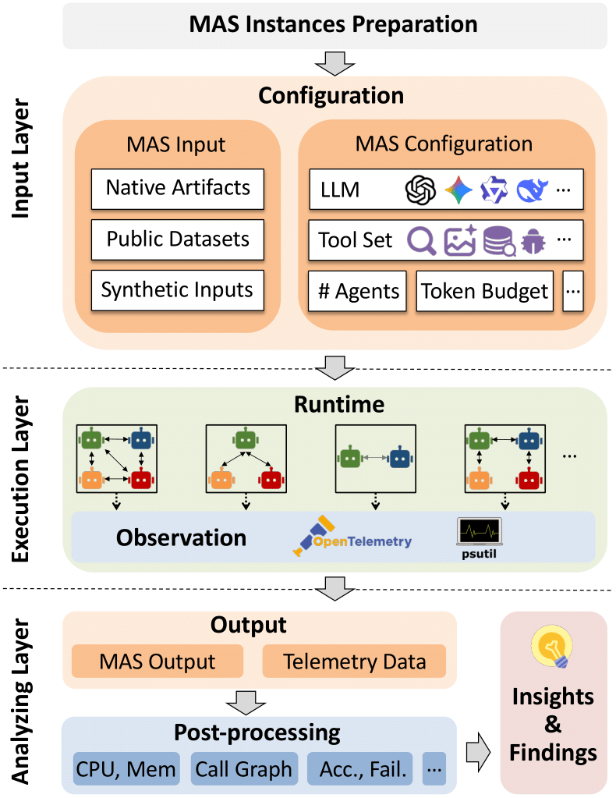

<p align="center">
    
</p>

# MAESTRO: Multi-Agent Evaluation Suite for Testing, Reliability, and Observability

MAESTRO is a framework-agnostic evaluation suite for LLM-based multi-agent systems (MAS), developed to benchmark, observe, and analyze MAS behavior from a systems perspective.

The stochastic and dynamic execution of LLM-powered MAS makes it difficult to debug and analyze system performance, understand resource usage per component, and determine whether agents should be split or optimized for efficiency. MAESTRO addresses this by providing a representative set of ready-to-run scenarios, a unified evaluation interface, and framework-agnostic metrics to measure performance, reliability, and system-level behavior across heterogeneous MAS setups.

**What MAESTRO provides:**

- A repository of representative MAS instances
- A unified configuration interface for consistent cross-framework MAS evaluation
- Execution traces and system-level signals including latency, network utilization, and failures

<p align="center">
    
</p>

## Available MAS examples
MAS examples can be found under the `examples` directory.
You can run multiple benchmarks using the `run_benchmarks.py` script inside that folder.
For example-specific instructions, click the links in the table below to open each example's README.

| Example | App. Field | Framework | Int. Type | #Agents | #Tools | Data In | Data Out |
|:-------:|:---------:|:---------:|:---------:|:-------:|:------:|:-------:|:--------:|
| [Fin. Analyzer](./examples/mcp-agent/mcp_financial_analyzer_benchmark) | Finance | MCP-Agent | Correct | 6 | 1 | Artifacts | Opn-End |
| [Img. Scr.](./examples/adk/image-scoring) | Creativity | ADK | Debate | 4 | 2 | Artifacts | Cls-Form |
| [Marketing](./examples/adk/marketing-agency) | Marketing | ADK | Coord. | 4 | 1 | Artifacts | Opn-End |
| [Brand SEO](./examples/adk/brand-search-optimization) | Marketing | ADK | Coord. | 4 | 10 | Artifacts | Opn-End |
| [Content Creat.](./examples/adk/content-creation) | Creativity | ADK | Plan | 4 | 1 | Artifacts | Opn-End |
| [Mag.-One](./examples/autogen/Magentic-One) | Cross-domain | Autogen | Plan | 4 | 0 | Artifacts | Opn-End |
| [Stock Res.](./examples/autogen/Stock-Research-Example) | Finance | Autogen | Coord. | 4 | 2 | Artifacts | Opn-End |
| [Travel Plan.](./examples/autogen/Travel-Planning) | Travel | Autogen | Coord. | 4 | 0 | Artifacts | Opn-End |
| [ToT](./examples/langgraph/tree-of-thoughts) | Cross-domain | LangGraph | Debate | 3 | 0 | Artifacts | Cls-Form |
| [CRAG](./examples/langgraph/crag) | Cross-domain | LangGraph | Coord. | 5 | 2 | Datasets | Opn-End |
| [Plan & Exec.](./examples/langgraph/Plan-and-Execute) | Cross-domain | LangGraph | Plan | 3 | 1 | Datasets | Opn-End |
| [LATS](./examples/langgraph/language-agent-tree-search) | Cross-domain | LangGraph | Plan | 3 | 1 | Datasets | Opn-End |

### Datasets

We open source our collected datasets for MAS execution and resource usage, which is available at https://huggingface.co/datasets/kaust-generative-ai/maestro-mas-benchmark

### Trace Examples

#### Plan-and-Execute (LangGraph, gpt-4o-mini + Tavily)
- Trace file: `data/example/run_20251223_020529.otel.jsonl`
- Summary: 76 spans, 25 `call_llm` spans, 51 `invoke_agent` spans, 70,197 input tokens, 2,974 output tokens, ~138.7s wall time, max replanner retry attempt 24, final status ERROR (GraphRecursionError).


```json
{
  "trace_id": "01a0b8e663cdb64112fe4c44291b0e33",
  "span_id": "000c8e48d640b5e7",
  "name": "plan_execute.call_llm.planner",
  "agent_name": "plan_and_execute_benchmark.llm.planner",
  "start_time": 1766455529802170196,
  "end_time": 1766455532579976422,
  "duration_ns": 2777806226,
  "attributes": {
    "gen_ai.operation.name": "call_llm",
    "langgraph.phase": "planner",
    "gen_ai.request.model": "gpt-4o-mini",
    "gen_ai.usage.total_tokens": 251,
    "gen_ai.llm.call.count": 1,
    "agent.output.useless": false
  }
}
{
  "trace_id": "01a0b8e663cdb64112fe4c44291b0e33",
  "span_id": "093c5ef419cb8831",
  "name": "plan_execute.node.planner",
  "agent_name": "plan_and_execute_benchmark.node.planner",
  "start_time": 1766455529802089867,
  "end_time": 1766455532583673105,
  "duration_ns": 2781583238,
  "attributes": {
    "gen_ai.operation.name": "invoke_agent",
    "plan_execute.node": "planner",
    "plan_execute.plan.step_count": 4,
    "plan_execute.plan.preview": [
      "Identify the time period of the Russian Civil War...",
      "Determine the key events leading to the defeat...",
      "Research the date when the Russian Civil War effectively ended..."
    ]
  }
}
{
  "trace_id": "01a0b8e663cdb64112fe4c44291b0e33",
  "span_id": "7def16b387d7b677",
  "name": "plan_execute.run",
  "agent_name": "plan_and_execute_benchmark.run",
  "start_time": 1766455529800856493,
  "end_time": 1766455668502872238,
  "duration_ns": 138702015745,
  "status": {
    "status_code": "ERROR",
    "description": "GraphRecursionError: Recursion limit of 50 reached without hitting a stop condition..."
  },
  "attributes": {
    "gen_ai.operation.name": "invoke_agent",
    "run.outcome": "failure",
    "run.judgement": "wrong"
  }
}
```
<!--
Below are example traced multi-agent execution scenarios collected so far. Each showcases distinct coordination or infrastructure patterns relevant to MAS observability.

| Example | Source / URL | MAS | Feedback Loop | MCP Server Call | Caching | Scheduler / Orchestration | Multi-Client |
|---|---|:---:|:---:|:---:|:---:|:---:|:---:|
| Financial Analyzer | https://github.com/lastmile-ai/mcp-agent/tree/main/examples/usecases/mcp_financial_analyzer | ✓ | ✓ | ✓ | - | - | - |
| Semantic Caching | (Pending URL) | ✓ | ✓ | - | ✓ | - | - |
| Multi-Agent Tourist Scheduling System | https://github.com/agntcy/agentic-apps/tree/main/tourist_scheduling_system | ✓ | - | - | - | ✓ | ✓ |

Notes:
- Feedback Loop indicates adaptive iteration based on intermediate results or external signals.
- MCP Server Call denotes usage of Model Context Protocol server interfaces for tool/function invocation.
- Caching reflects explicit semantic or result caching to optimize repeated accesses.
- Scheduler / Orchestration highlights explicit role/task coordination beyond linear workflows.
- Multi-Client captures scenarios serving or simulating multiple end-user request contexts.
-->

### Citation

If you find MAESTRO or its dataset useful in your research, please consider citing the following paper:

```
@misc{maestro,
      title={MAESTRO: Multi-Agent Evaluation Suite for Testing, Reliability, and Observability},
      author={Tie Ma and Yixi Chen and Vaastav Anand and Alessandro Cornacchia and Amândio R. Faustino and Guanheng Liu and Shan Zhang and Hongbin Luo and Suhaib A. Fahmy and Zafar A. Qazi and Marco Canini},
      year={2026},
      eprint={2601.00481},
      archivePrefix={arXiv},
      primaryClass={cs.NI},
      url={https://arxiv.org/abs/2601.00481},
}
```

<!--
## References

### Foundational Works
1. [Making Sense of Performance in Data Analytics Frameworks](https://www.usenix.org/system/files/conference/nsdi15/nsdi15-paper-ousterhout.pdf) - USENIX NSDI 2015
2. [Useful Agentic AI: A Systems Outlook](https://saa2025.github.io/papers/Useful%20Agentic%20AI%20-%20A%20Systems%20Outlook.pdf) - Systems for Agentic AI Workshop 2025
3. [Evaluation and Benchmarking of LLM Agents: A Survey](https://arxiv.org/pdf/2507.21504) - ACM KDD 2025
4. [When Disagreements Elicit Robustness: Investigating Self-Repair Capabilities under LLM-based Multi-Agent Systems](https://arxiv.org/pdf/2502.15153?) - arXiv, work in progress
    - Code Writing Robustness (CWR): How similar the code outputs are across runs.
    - Code Decision Robustness (CDR): How consistent the execution results are across runs.
5. [Holistic Evaluation of Language Models](https://arxiv.org/pdf/2211.09110) - TMLR 2023
    - Only evaluate single LLM, not relevant to MAS
6. [ReliableEval: A Recipe for Stochastic LLM Evaluation via Method of Moments](https://arxiv.org/html/2505.22169v1)
    - Estimating the number of prompt resamplings needed to obtain meaningful results.
7. [LLM Stability: A detailed analysis with some surprises](https://arxiv.org/html/2408.04667v1)
8. [Beyond Black-Box Benchmarking: Observability, Analytics, and Optimization of Agentic Systems](https://arxiv.org/html/2503.06745v1) -- `ToRead`
9. [Traceability and Accountability in Role-Specialized Multi-Agent LLM Pipelines](https://arxiv.org/html/2510.07614) -- `ToRead`
10. [Testing and Enhancing Multi-Agent Systems for Robust Code Generation](https://arxiv.org/html/2510.10460)
11. [Evaluating Variance in Visual Question Answering Benchmarks](https://arxiv.org/html/2508.02645)
-->


## Developing MAESTRO
```bash
git clone git@github.com:sands-lab/maestro.git
cd maestro
uv sync
# Install pre-commit hooks
uv run -- pre-commit install
```
